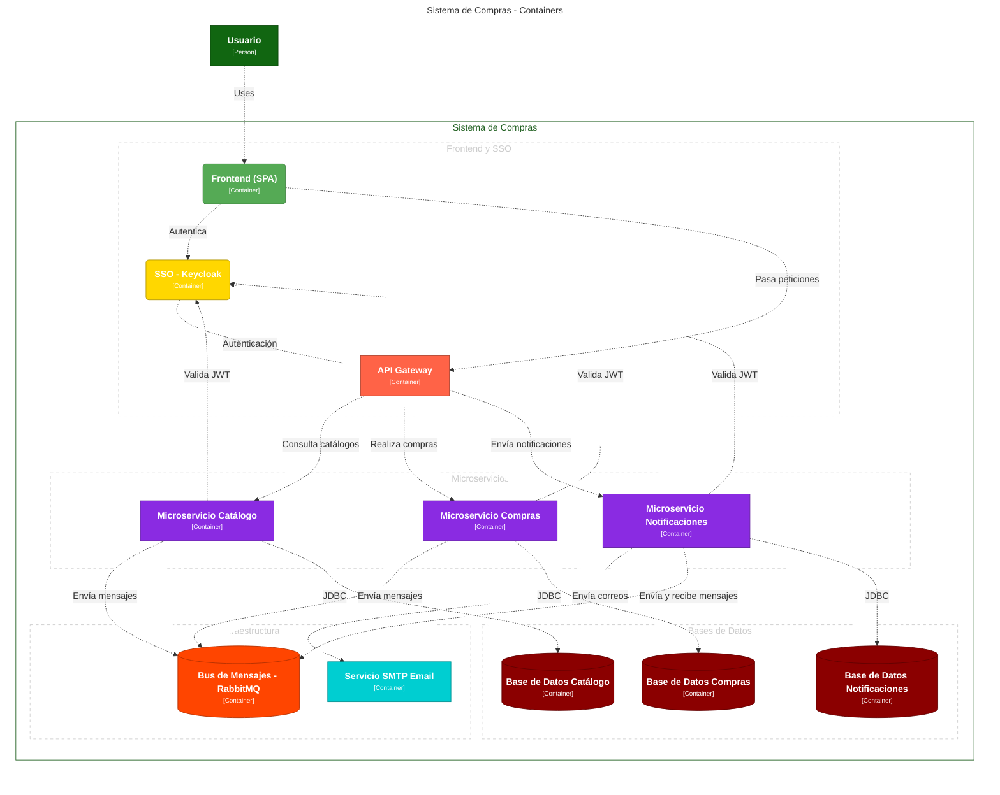

# springboot-sso y keycloak

## OPEN API
- https://springdoc.org/#spring-data-rest-support
- http://localhost:8080/swagger-ui/index.html


# SSO keycloak

## Keycloak client app web
```bash
curl --request POST 'http://localhost:9090/realms/videoclub/protocol/openid-connect/token' --header 'Content-Type: application/x-www-form-urlencoded' --data-urlencode 'client_id=web' --data-urlencode 'username=hmunoz' --data-urlencode 'password=hmunoz' --data-urlencode 'grant_type=password'
```
## Keycloak client app api
```shell
curl --request POST 'http://localhost:9090/realms/videoclub/protocol/openid-connect/token' --header 'Content-Type: application/x-www-form-urlencoded' --data-urlencode 'client_id=web' --data-urlencode 'username=hmunoz' --data-urlencode 'password=hmunoz'  --data-urlencode 'client_secret=78BoOMc7ZM2zbHHE3bU5JNnHInuErQVn' --data-urlencode 'grant_type=password'
```
## Test api
```shell
curl --location 'http://localhost:8080/api/tests' --header 'Authorization: Bearer <TOKEN>'
```

## Postman Callection get Token and Test Api 
- [VideoClub con Seguridad.postman_collection.json](postman%2FVideoClub%20con%20Seguridad.postman_collection.json)
- 

# keycloak Realms, groups and roles, users
## Realms videoclub
- http://localhost:9090/admin/master/console/#/realms/videoclub


## Aauthdebugger Oauth2 and JWT
- https://jwt.io/
- https://oauthdebugger.com/


# Dependencias del proyecto Spring Boot con Maven

## Seguridad
- `spring-boot-starter-security`: Proporciona funcionalidades de seguridad para aplicaciones Spring Boot.
- `spring-boot-starter-oauth2-resource-server`: Permite configurar la aplicación como un servidor de recursos OAuth 2.0.
- `spring-security-oauth2-jose`: Ofrece soporte para el estándar JOSE (JSON Object Signing and Encryption) en Spring Security.

## Web y Validación
- `spring-boot-starter-web`: Starter para construir aplicaciones web, incluyendo RESTful, usando Spring MVC.
- `spring-boot-starter-validation`: Proporciona soporte para la validación de beans.

## Persistencia
- `spring-boot-starter-data-jpa`: Facilita el uso de JPA para la persistencia de datos.
- `postgresql`: Driver JDBC para PostgreSQL.

## Manejo de Errores
- `error-handling-spring-boot-starter`: Librería para manejar errores de forma más efectiva en aplicaciones Spring Boot.

## Documentación API
- `springdoc-openapi-starter-webmvc-ui`: Genera documentación OpenAPI 3 para APIs Spring Boot.

## Métricas y Monitoreo
- `spring-boot-starter-actuator`: Añade endpoints para monitorear y manejar la aplicación.
- `micrometer-registry-prometheus`: Permite exponer métricas en formato Prometheus.

## Utilidades de Desarrollo
- `lombok`: Reduce el código repetitivo (getters, setters, constructores, etc.) mediante anotaciones.
- `spring-boot-devtools`: Proporciona herramientas de desarrollo, incluyendo reinicio automático.
- `spring-boot-docker-compose`: Integración con Docker Compose para Spring Boot.

## Testing
- `spring-boot-starter-test`: Proporciona dependencias comunes para testing en Spring Boot.


# Acceso y Servicios en MicroK8s

## configurar config m8s

## Mailhog (smtp)

[Mailhog (Web UI)](https://k8s-lia.unrn.edu.ar/mailhog/)

- mailhog.email.svc.cluster.local
- smtp port 1025

## Keycloak  (SSO)

[Keycloak (Admin)](https://k8s-lia.unrn.edu.ar/keyclaok/)

- realms: videoclub01 al 05

## Postgres (RDS)

[Postgres (Pgadmin)](https://k8s-lia.unrn.edu.ar/pgadmin/browser/)

## minio (bucket S3)
[Minio API - necesita acceses key y secret por grupo](https://k8s-lia.unrn.edu.ar)
[Ejemplo imagen](https://k8s-lia.unrn.edu.ar/grupo03/unrnlogo.jpg)

## TODO

### proyecto keycloakify para personalizar el login con react
https://medium.com/@abdurrahmanekr/change-your-keycloak-login-interface-using-with-keycloakify-032b00539ccb

### spring-boot-with-hibernate-2nd-level-cache-on-redis
https://medium.com/@shahto/scaling-spring-boot-with-hibernate-2nd-level-cache-on-redis-54d588fc8b06

### keycloak-event-listener-rabbitmq
https://github.com/aznamier/keycloak-event-listener-rabbitmq
https://github.com/bitnami/charts/issues/7865
https://blog.elest.io/publish-keycloak-events-to-rabbitmq/

The routing key is calculated as follows:

admin events: KK.EVENT.ADMIN.<REALM>.<RESULT>.<RESOURCE_TYPE>.<OPERATION>
client events: KK.EVENT.CLIENT.<REALM>.<RESULT>.<CLIENT>.<EVENT_TYPE>
And because the recommended exchange is a TOPIC (amq.topic),
therefore its easy for Rabbit client to subscribe to selective combinations eg:

all events: KK.EVENT.#
all events from my realm: KK.EVENT.*.MYREALM.#
all error events from my realm: KK.EVENT.*.MYREALM.ERROR.#
all user events from my-relam and my-client: KK.EVENT.*.MY-REALM.*.MY-CLIENT.USER

### Documentation
- https://ravthiru.medium.com/springboot-oauth2-with-keycloak-for-bearer-client-3a31f608a78
- https://www.baeldung.com/spring-boot-keycloak
- https://medium.com/@bcarunmail/securing-rest-api-using-keycloak-and-spring-oauth2-6ddf3a1efcc2
- https://www.baeldung.com/postman-keycloak-endpoints#1-openid-configuration-endpoint
- https://medium.com/@agayevilkin76/api-gateway-swagger-ui-config-for-spring-boot-6d51a0294a34

# modelo c4  
## https://structurizr.com/dsl
- fomato mermaid

